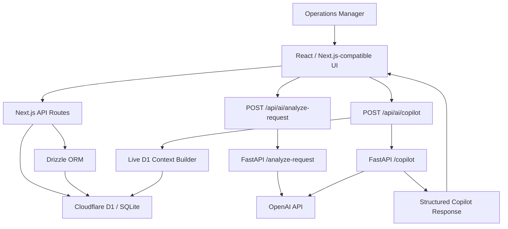

# ResolveOps

AI-powered hospitality operations platform for intelligent service request triage, SLA tracking, technician workflows, and grounded operational decision support.

## Overview

Hospitality and service operations teams receive guest and facility requests that must be understood quickly, prioritized correctly, assigned to the right technician, tracked against SLA deadlines, and visible to managers in real time.

ResolveOps demonstrates how AI can be integrated into that operational workflow without turning the product into a generic chatbot. Natural-language service requests are analyzed by a FastAPI AI service, saved into a Cloudflare D1-backed workflow, shown on a live dashboard, managed through technician assignment and lifecycle controls, and summarized by a read-only Operations Copilot grounded in current operational data.

## Key Features

### AI Request Intelligence

- Accepts natural-language service request descriptions.
- Sends requests to a Python FastAPI AI service.
- Uses OpenAI structured outputs with Pydantic response models.
- Classifies operational title, category, priority, department, summary, location, sentiment, escalation need, and suggested response.
- Autofills the request workflow so the manager can review and create the service request.
- Avoids inventing missing locations or incident details in the request analysis prompt.

### AI Operations Copilot

- Provides a multi-turn operations assistant for manager questions such as "What needs my attention right now?", "Which request is most urgent?", and "What is Khalid working on?"
- Builds fresh structured context from live D1 data through the Next.js server layer on every Copilot request.
- Supplies active requests, technician names, SLA state, current metrics, and recent activity to the AI service.
- Returns structured answers with an attention level, referenced request IDs, recommended manager actions, and an insufficient-context flag.
- Runs in read-only mode: it does not create requests, assign technicians, change statuses, resolve work, or mutate the database.
- Includes grounding rules designed to reduce hallucination risk and prevent unsupported operational claims.

This phase is structured-data grounding, not retrieval-augmented generation (RAG). A knowledge-base retrieval layer is planned separately.

### SLA & Operations Dashboard

- Creates priority-based SLA deadlines for new service requests.
- Displays active requests with live SLA countdowns.
- Tracks SLA-at-risk work, including overdue requests and requests due within one hour.
- Uses Asia/Riyadh calendar logic for daily and monthly dashboard metrics.
- Shows active requests, due-today counts, SLA-at-risk counts, and resolved-this-month metrics from live data.

### Technician & Request Lifecycle

- Includes demo technicians Ali, Khalid, and Ahmed from the users table.
- Supports technician assignment and unassignment.
- Supports request lifecycle states: `new`, `assigned`, `in_progress`, `on_hold`, `resolved`, and `closed`.
- Records request activity for meaningful lifecycle changes.
- Refreshes the dashboard after request creation or lifecycle updates.
- Removes resolved or closed requests from the Active requests table while keeping resolved metrics accurate.

## Architecture



The application layer owns database access. The Next.js API routes query D1 through Drizzle, build operational context, and call the Python AI service. The AI service owns LLM prompts and structured output parsing. API keys remain server-side.

## Tech Stack

### AI

- OpenAI API
- Python
- FastAPI
- Pydantic structured outputs

### Frontend

- React
- TypeScript
- Next.js-compatible app structure
- Vite / vinext

### Backend & Data

- Next.js API routes
- REST APIs
- Cloudflare Workers architecture
- Cloudflare D1
- SQLite
- Drizzle ORM

### Development

- Git
- GitHub

## Example Workflow

Example service request:

> The AC in room 504 stopped working and the guest is extremely upset.

1. The manager enters the natural-language request.
2. The FastAPI AI service analyzes the text with OpenAI structured outputs.
3. ResolveOps classifies the request as an HVAC issue, sets an operational priority, and extracts the location when supplied.
4. The manager reviews the generated operational fields.
5. The request is saved to Cloudflare D1.
6. A priority-based SLA deadline is created.
7. The operations manager assigns a technician.
8. The request moves through the lifecycle from new to assigned, in progress, on hold, resolved, or closed.
9. The Operations Copilot can later identify overdue or urgent work from the current D1 state.

## Grounded AI Design

ResolveOps is designed so the database remains the source of operational truth. The Copilot route reads current D1 state on each request, maps technician IDs to actual user names, computes SLA labels before calling the LLM, and sends only the structured context needed for operational reasoning.

The Copilot prompt instructs the model to use only supplied OperationsContext facts, avoid unsupported requests, locations, technicians, deadlines, procedures, or incidents, and mark answers as insufficient when context is missing. Referenced request IDs are filtered to active requests in the supplied context. SOPs, maintenance manuals, manufacturer documentation, and knowledge-base answers are not fabricated because no retrieval layer is connected yet.

This design reduces hallucination risk while keeping operational actions read-only. The Copilot can recommend manager actions, but it does not execute them.

## Repository Structure

```text
app/
  React UI, dashboard components, and Next.js-compatible API routes.

ai-service/
  FastAPI service for AI request analysis and Operations Copilot reasoning.

db/
  Drizzle D1 database helper and schema definitions.

drizzle/
  Generated SQLite migration SQL and Drizzle metadata.
```

## Local Development

### Frontend / Application

```bash
npm install
npm run dev -- --port 5173
```

The app expects a Cloudflare D1 binding named `DB`. The repository includes Drizzle schema in `db/schema.ts`, migration SQL in `drizzle/`, and local Cloudflare binding configuration in `wrangler.local.jsonc`. The build packaging step copies `.openai/hosting.json` and `drizzle/` into the build output. There is no separate seed script in this repository.

For schema changes, generate migrations with:

```bash
npm run db:generate
```

### AI Service

```bash
cd ai-service
python3.12 -m venv .venv
source .venv/bin/activate
pip install -r requirements.txt
cp .env.example .env
uvicorn app.main:app --reload --port 8000
```

Configure `OPENAI_API_KEY` privately in `ai-service/.env`. Do not commit secrets. `OPENAI_MODEL` can also be set there; the example file includes the default used by the service.

The Next.js AI bridge defaults to `http://127.0.0.1:8000` and can be pointed elsewhere with `RESOLVEOPS_AI_URL`.

## API Highlights

### Application API

- `GET /api/requests` - returns active service requests and live dashboard metrics.
- `POST /api/requests` - creates a service request with a priority-based SLA deadline.
- `PATCH /api/requests` - updates technician assignment and request status.
- `GET /api/technicians` - returns technician users for the demo organization.
- `POST /api/ai/analyze-request` - bridges request text to the FastAPI analysis service.
- `POST /api/ai/copilot` - builds fresh operational context and bridges questions to the FastAPI Copilot service.

### FastAPI AI Service

- `GET /health` - returns AI service health.
- `POST /analyze-request` - returns structured request classification.
- `POST /copilot` - returns a structured grounded operations answer.

## Screenshots

Screenshots are planned under `docs/screenshots/`. Image links are intentionally omitted until the actual files are added, so the public README does not contain broken images.

See [docs/screenshots/README.md](docs/screenshots/README.md) for the screenshot checklist.

## Current Scope & Roadmap

### Implemented

- AI request intelligence with structured outputs.
- Live service request workflow backed by D1.
- SLA deadline creation and dashboard metrics.
- Technician assignment and request lifecycle management.
- Request activity logging.
- Grounded, read-only AI Operations Copilot.
- Multi-turn Copilot chat in the browser.

### Planned

- Document knowledge-base retrieval / RAG.
- Vector search for operational documents.
- Dockerized deployment.
- Cloud deployment.
- Optional messaging or voice integrations.

Planned features are not implemented in the current version.

## Why I Built This

ResolveOps was built as a portfolio engineering project to show how LLMs can be integrated into real operational software: structured inputs and outputs, server-side data grounding, persistence, workflow state, and manager-facing decision support rather than a standalone chatbot.
